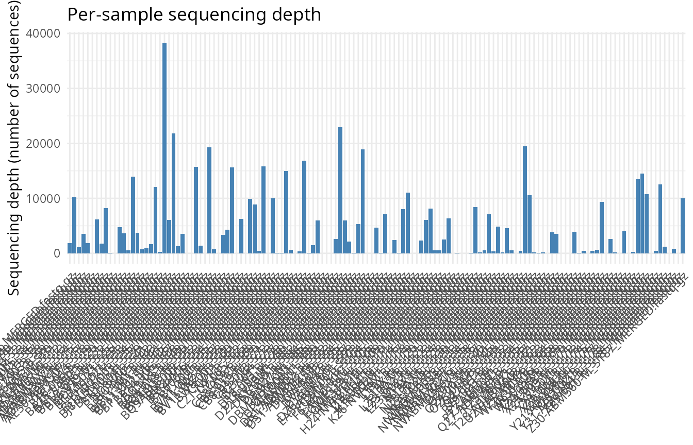
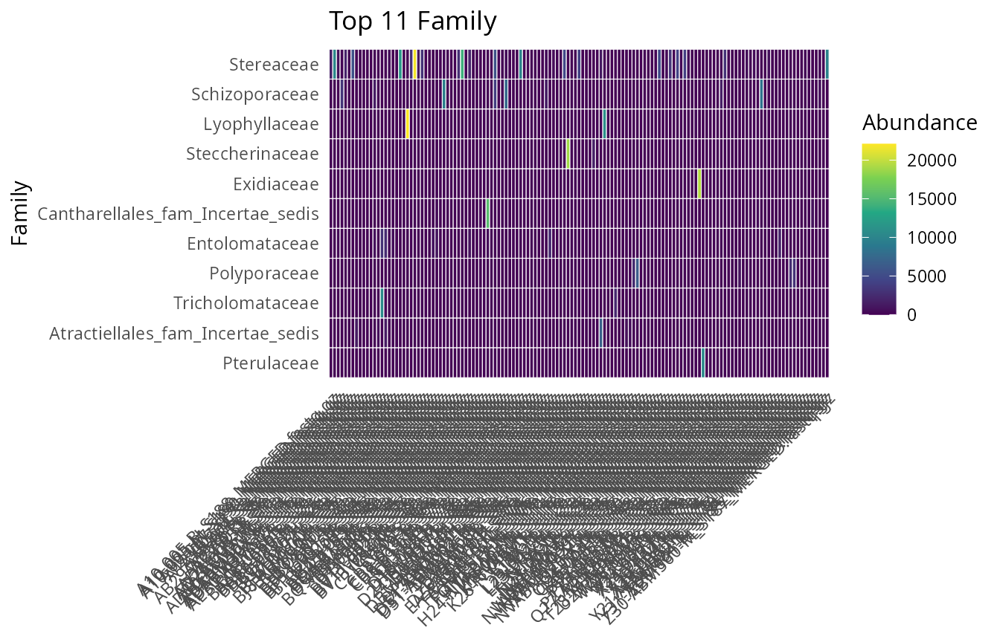
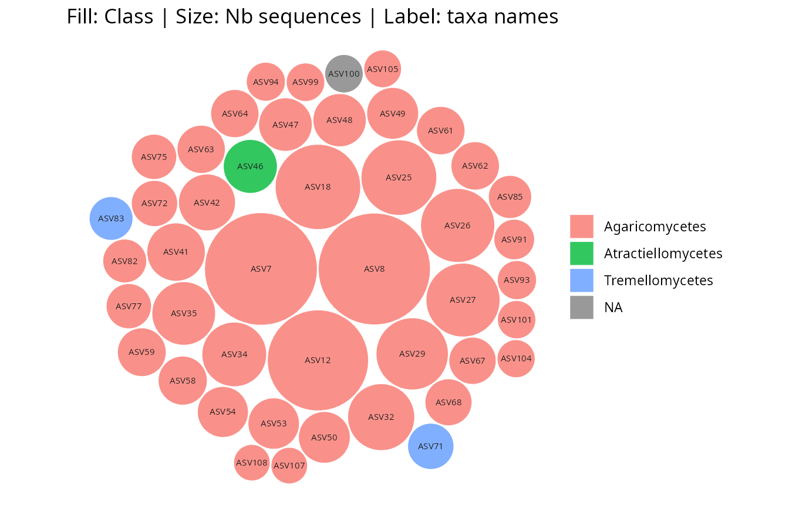
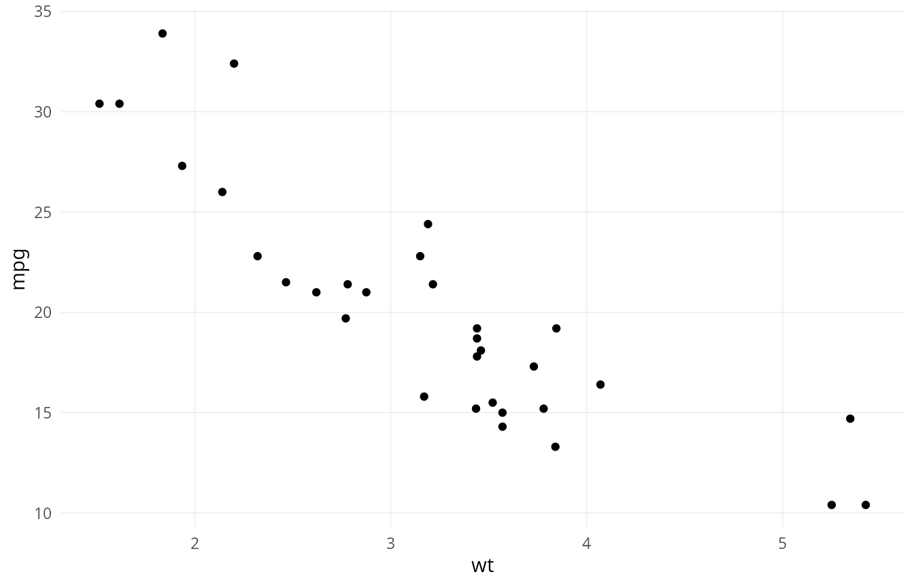
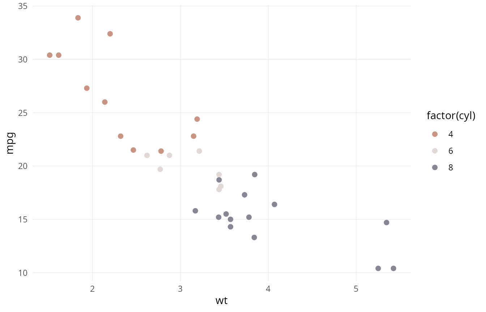

# Get started with ggplotpq

## What ggplotpq is for

`ggplotpq` is the **`ggplot2` visualisation layer** of the
[pqverse](https://github.com/adrientaudiere). It owns pure `ggplot2`
helpers (geoms, themes, scales, colour/palette management) and
single-`phyloseq` `ggplot` wrappers that previously lived in
[`MiscMetabar`](https://adrientaudiere.github.io/MiscMetabar/) or
`comparpq`.

It is deliberately **not** for cross-package multi-`phyloseq`
comparators (those stay in `comparpq`), nor for machine-learning /
networks (those stay in `netaipq`). Genuinely new analysis methods
belong in `netaipq`; `ggplotpq` may render their plots, but does not
host the analysis.

## Installation

``` r
# install.packages("remotes")
remotes::install_github("adrientaudiere/ggplotpq")
```

``` r
library(ggplotpq)
library(ggplot2)
data(data_fungi_mini, package = "MiscMetabar")
```

## Plotting helpers for phyloseq objects

[`plot_sample_depth_pq()`](https://adrientaudiere.github.io/ggplotpq/reference/plot_sample_depth_pq.md)
summarises sequencing depth across samples — a quick first diagnostic
before any rarefaction or normalisation.

``` r
plot_sample_depth_pq(data_fungi_mini)
```



[`plot_taxa_heatmap_pq()`](https://adrientaudiere.github.io/ggplotpq/reference/plot_taxa_heatmap_pq.md)
shows the most abundant taxa across samples, at the taxonomic rank of
your choice.

``` r
plot_taxa_heatmap_pq(data_fungi_mini, n_top = 15, taxa_rank = "Family")
```



[`gg_bubbles_pq()`](https://adrientaudiere.github.io/ggplotpq/reference/gg_bubbles_pq.md)
lays out taxa as bubbles sized by abundance and coloured by a taxonomic
rank.

``` r
gg_bubbles_pq(physeq = data_fungi_mini, rank_color = "Class")
```



## Themes, palettes, and scales

`ggplotpq` ships reusable `ggplot2` building blocks that work on any
plot, not only `phyloseq` ones.
[`theme_pq_minimal()`](https://adrientaudiere.github.io/ggplotpq/reference/theme_pq_minimal.md)
is a clean, publication-oriented theme:

``` r
ggplot(mtcars, aes(wt, mpg)) +
  geom_point() +
  theme_pq_minimal()
```



The `scale_*_pq_discrete()` family gives curated discrete palettes:

``` r
ggplot(mtcars, aes(wt, mpg, color = factor(cyl))) +
  geom_point(size = 2) +
  scale_color_pq_discrete("Picabia") +
  theme_pq_minimal()
```



The `idest` family
([`theme_idest()`](https://adrientaudiere.github.io/ggplotpq/reference/theme_idest.md),
[`idest_pal()`](https://adrientaudiere.github.io/ggplotpq/reference/idest_pal.md),
`scale_color_idest_*()`, `scale_fill_idest_*()`) provides a coordinated
branded look; see the [function
reference](https://adrientaudiere.github.io/ggplotpq/reference/index.md)
for the full set.

## Where to go next

- The [function
  reference](https://adrientaudiere.github.io/ggplotpq/reference/index.md)
  is organised by origin (migrated from `MiscMetabar`, from `comparpq`,
  from `taxinfo`) and by new visualisation helpers.
- Because every function returns a standard `ggplot` object, you can
  freely combine `ggplotpq` helpers with each other and with the wider
  `ggplot2` ecosystem (`patchwork`, custom scales, and so on).
